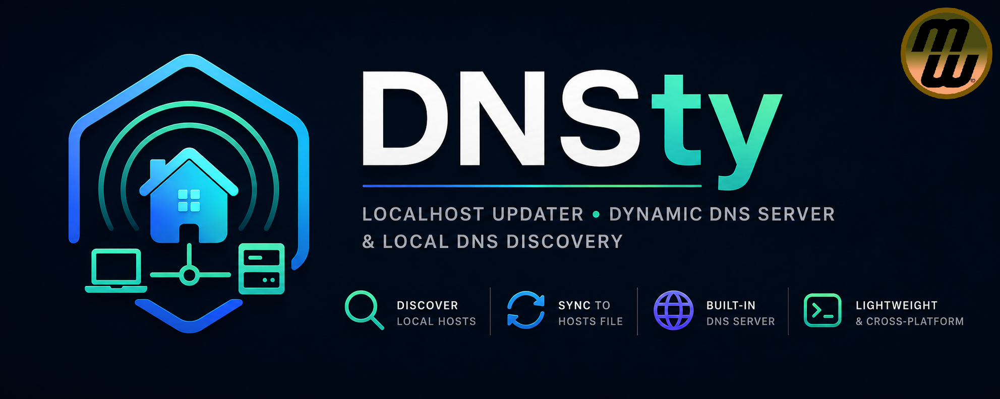

# DNSty



Automatically discover devices, synchronize your hosts file, and serve local DNS records — keeping your development and home networks always up-to-date.

## Intro

DNSty is a **lightweight, cross‑platform Rust application** that provides:
- Automatic discovery of hosts on your local network.
- Seamless synchronization of discovered hosts into your system's `hosts` file.
- An optional DNS server that resolves local hostnames.
- Configurable refresh intervals, logging, and graceful cleanup on exit.

Designed for DevOps and power‑users who need a **zero‑configuration** way to keep their local DNS up‑to‑date.

---

## Features

- **Discovery** – Fast, asynchronous scanning of local DNS servers to find active hosts.
- **Hosts Sync** – Writes discovered entries to `/etc/hosts` (or the OS‑specific hosts file) with optional backup/undo on shutdown.
- **Optional DNS Server** – Runs a tiny DNS server that resolves the discovered names.
- **Configurable** – YAML configuration (`config.yaml`) to enable/disable components, set timeouts, and control logging.
- **Graceful Shutdown** – Restores the original hosts file if `undo_hosts_on_exit` is true.
- **Cross‑Platform** – Works on Linux, macOS, and Windows (via the provided Cargo build).

---

## Installation

The easiest way to install DNSty is just to download the file for your OS/arch and unzip it.

---

## Configuration

Create a `config.yaml` next to the binary (or in the working directory) with the following structure:

```yaml
# Enable the optional DNS server (true/false)
dns_server: true

# Refresh interval in seconds for periodic discovery
refresh_interval_secs: 300

# Timeout for each discovery attempt (seconds)
discovery_timeout_secs: 5

# Undo changes to the hosts file when the program exits
undo_hosts_on_exit: true

# Optional custom domain that will be appended to each discovered host
# e.g. "local" will turn "my‑pc" into "my‑pc.local"
default_domain: "local"

# Override the default gateway if autodetection fails
#gateway_override: "192.168.1.1"

# Logging configuration (optional)
log: "dnsty.log"
```

> **Tip:** If `gateway_override` is omitted, DNSty will attempt to discover your local network automatically.

---

## Usage

Run the binary with optional flags to control output:

```bash
dnsty [OPTIONS]
```

### Options

| Flag | Description |
|------|-------------|
| `-q`, `--quiet` | Suppress console output (only errors are shown). |
| `-d`, `--debug` | Enable verbose debug logging. |
| `-l <FILE>`, `--log <FILE>` | Write logs to the specified file instead of stdout. |

Example:

```bash
# Run with debug logging and write logs to a file
 dnsty --debug --log dnsty_debug.log
```

The program will:
1. Load `config.yaml`.
2. Perform an initial host discovery.
3. Sync the hosts file.
4. Optionally start the DNS server.
5. Periodically repeat discovery according to `refresh_interval_secs`.
6. Respond to `Ctrl+C` for graceful shutdown.

---

## Example Workflow

1. **Start DNSty**
   ```bash
   dnsty
   ```
   You’ll see log lines such as:
   ```
   DNSty DNS server starting
   Configuration loaded
   Local network detected: IP=192.168.1.10, Gateway=192.168.1.1, DnsServers=["192.168.1.1"], Domain=local
   Discovery via 192.168.1.1 found 12 hosts
   Initial discovery complete: found 12 hosts in 2 secs
   ```
2. **Verify the hosts file**
   ```bash
   cat /etc/hosts | grep "my-pc"
   ```
3. **Optional DNS queries**
   ```bash
   dig my-pc.local @127.0.0.1
   ```
4. **Stop DNSty**
   Press `Ctrl+C`. If `undo_hosts_on_exit` is true, the original hosts file is restored.

---

## FAQ

- **Do I need to run as root?**
  - Updating the system hosts file typically requires elevated privileges. Run `sudo dnsty` or configure the binary with the necessary permissions.
- **Can I run DNSty as a background service?**
  - Yes. Use a systemd unit or launchd plist that invokes the binary with your desired flags.
- **What platforms are supported?**
  - Linux, macOS, and Windows (via Cargo). The DNS server binds to `127.0.0.1` by default.

---

## Contributing

Contributions are welcome! Please fork the repository, make your changes, and open a Pull Request. Follow the existing code style (Rustfmt) and ensure `cargo test` passes.

---

## License

Distributed under the **MIT License**. See `LICENSE.md` for details.
